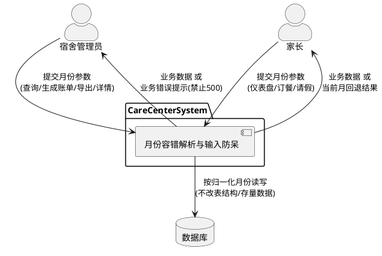
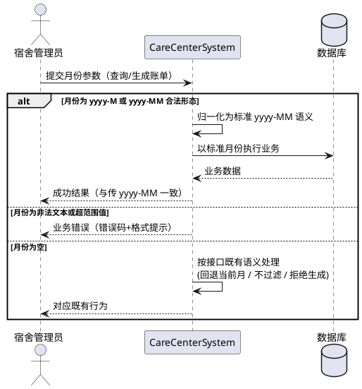
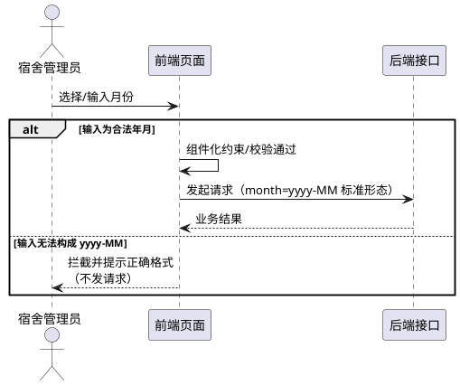

# CareCenterSystem 月份参数容错解析与输入防呆 需求规格

> **文档性质**：bug 修复需求规格（SDD 第一阶段产出）
> **关联缺陷**：后端接口抛出 `java.time.format.DateTimeParseException: Text '2026-6' could not be parsed at index 5`（月份参数未补零导致解析失败）
> **版本**：v1.0（2026-09-05）
> **状态**：待用户评审

---

# 1. 组件定位

## 1.1 核心职责
本需求负责保障 CareCenterSystem 全部涉及"年月（yyyy-MM）"参数的接口在任意输入形态下均能正确解析、给出友好响应，并防止前端产生非法月份输入，实现 [月份参数的统一容错解析与输入防呆]，消除因月份格式问题引发的 500 异常。

## 1.2 核心输入
1. **后端接口的月份参数（month）**：来源于前端页面（账单管理、家长仪表盘、缴费管理等）与系统内部定时任务，形态可能为 `yyyy-MM`（标准补零）、`yyyy-M`（未补零）、空值或非法文本。
2. **数据库存量账单月份字段（bill_month）**：以字符串存储，现网存量值均为补零格式（如 `2026-04`），参与账单详情等场景的月份计算。

## 1.3 核心输出
1. **接口响应**：月份参数合法时返回与现有语义一致的业务数据；非法时返回携带错误码与提示语的业务错误响应（而非 500 异常）。
2. **业务数据**：账单生成、账单查询、统计、导出、家长端仪表盘等结果的正确性不受月份输入形态影响。

## 1.4 职责边界
本需求**不负责**：
1. 数据库表结构变更或 `bill_month` 字段存储格式的调整（明确禁止改表）。
2. 日期时间以外参数（如学号、状态、搜索关键字）的校验增强。
3. Excel 导入等文件通道中月份内容的治理（导入通道已有自身逻辑，本次不扩展）。
4. 其他已核实为补零格式的前端入口（缴费管理、家长仪表盘、家长订餐、家长请假）的功能改动——仅需保证其行为不因本次修复而变化。

# 2. 领域术语

**账单月份（billMonth / bill_month）**
: 标识一笔账单或计费记录所属自然月的业务字段，业务上以 `yyyy-MM` 形态表示（如 `2026-04`），当前以字符串形式存储。

**标准月份形态**
: 年份为四位数字、月份为两位数字（01–12）、以连字符连接的字符串形态，即 `yyyy-MM`（如 `2026-06`）。

**未补零月份形态**
: 年份为四位数字、月份为一位数字（1–9，无前导零）、以连字符连接的字符串形态，即 `yyyy-M`（如 `2026-6`）。业务含义与补零形态一一等价。

**月份参数（month）**
: 前端或调用方传递给后端接口、用于指定目标自然月的请求参数。

**月份容错解析**
: 将 `yyyy-MM` 与 `yyyy-M` 两种合法形态的月份字符串统一转换为等价年月值的处理能力；对无法解析的内容不抛出未处理异常，而是产生明确的业务错误或按既有语义回退。

**输入防呆**
: 前端通过受控输入组件或校验逻辑，保证提交给后端的月份参数始终为标准形态的机制。

# 3. 角色与边界

## 3.1 核心角色
1. **宿舍管理员（admin）**：在账单管理页面按月份查询账单、生成月度账单、导出账单 Excel，是本缺陷的直接触发者。
2. **家长（parent）**：通过家长端仪表盘、订餐预约等页面按月份查看孩子数据，其输入正常情况下为受控格式。
3. **宿舍管理员（订餐审核）**：在订餐审核页面按月份筛选审核记录（同类自由文本月份输入入口）。

## 3.2 外部系统
1. **前端应用（CareCenter_frontend）**：向上游用户采集月份输入并向后端接口发起携带 `month` 参数的请求，是非法月份的唯一外部来源通道。
2. **数据库（carecentermanagement）**：存储账单月份等业务数据，本需求视其为只读约束对象（不改结构、不改存量数据）。

## 3.3 交互上下文

# 4. DFX 约束

## 4.1 性能
1. 月份容错解析为轻量字符串处理，单次解析引入的额外耗时必须可忽略（不得对接口整体响应时间产生可感知劣化）。
2. 不得因归一化处理引入新的循环查库或批量重算行为。

## 4.2 可靠性
1. 任何月份形态的输入（合法、非法、空值）都不得导致后端抛出未处理异常（HTTP 500）。
2. 修复后三条月份解析链路（账单生成、计费记录生成、家长端仪表盘）及账单详情场景必须全部回归通过。

## 4.3 安全性
1. 非法输入的错误响应中不得向用户暴露堆栈信息、内部类名或解析器细节，仅给出面向业务的格式提示。
2. 非法月份输入属于用户输入注入的攻击面，必须作为普通业务校验失败处理并可留下服务端日志（日志级别与内容遵循现有规范，不得包含敏感数据）。

## 4.4 可维护性
1. 容错解析能力必须以统一、可复用的方式提供，禁止在多个解析点重复散落各自为政的格式判断逻辑（具体落地形式由设计阶段决定）。

## 4.5 兼容性
1. 不得变更数据库表结构及 `bill_month` 存量数据的存储格式。
2. 所有现有以补零格式提交月份的调用方行为必须保持不变。

# 5. 核心能力

## 5.1 后端月份参数容错解析

### 5.1.1 业务规则（EARS 需求）

**REQ-B01 未补零形态等价解析**
当后端任一接口接收到形态为 `yyyy-M` 的月份参数（如 `2026-6`）时，系统应当将其按 `yyyy-MM` 等价语义处理（如 `2026-6` 等价于 `2026-06`），并据此完成后续业务逻辑。
a. 验收标准：以 `month=2026-6` 分别调用账单查询、账单生成、家长端仪表盘接口，响应均为成功，且业务结果与传入 `month=2026-06` 时完全一致（生成账单的账单月份落库值为标准形态 `2026-06`）。

**REQ-B02 标准形态行为不变**
当月份参数已为标准 `yyyy-MM` 形态且月份取值合法（01–12）时，系统应当保持现有处理逻辑与返回结果完全不变。
a. 验收标准：以 `month=2026-06` 回归全部相关接口，前后行为与响应内容一致，无任何回归差异。

**REQ-B03 非法输入业务错误**
当月份参数为无法解析为年月的内容（任意非年月文本、超范围月份如 `2026-13`、超范围取值如月份为 `00` 等）时，系统应当返回携带统一错误码与明确格式提示（如"月份格式不正确，应为 yyyy-MM"）的业务错误响应，禁止以未处理异常（HTTP 500）形式返回。
a. 验收标准：以 `month=abc`、`month=2026-13`、`month=202` 等非法值调用相关接口，响应均为业务错误结构（错误码 + 提示语），HTTP 层面不出现 500，响应体中不含堆栈或内部实现细节。

**REQ-B04 空输入保持既有语义**
当月份参数为空（未传或空串）时，系统应当保持各接口现有语义：家长端仪表盘类接口回退至当前自然月；账单查询、统计、导出类接口不按月份过滤、返回全部数据；账单生成类接口返回"月份必填"的业务错误提示（不默认生成任何月份的账单）。
a. 验收标准：不传 `month` 调用家长端仪表盘，返回当前自然月数据（与修复前一致）；不传 `month` 调用账单查询/统计/导出，返回全部数据（与修复前一致）；传空串调用账单生成接口，返回月份必填的业务错误而非 500，且不产生任何账单数据。

**REQ-B05 解析路径全覆盖**
当任一业务场景需要将月份字符串转换为年月值时（包括账单生成、计费记录生成、家长端仪表盘、以及账单详情中读取存量账单月份参与计算的场景），系统应当经由统一的月份容错解析能力完成，系统中不得残留会因 `yyyy-M` 形态或异常存量数据而直接抛出解析异常的处理路径。
a. 验收标准：对账单生成（两条生成链路）、家长端仪表盘、账单详情四类场景分别注入 `2026-6` 形态与非法文本，均满足 REQ-B01 或 REQ-B03 的行为；不存在未纳入容错的解析点。

### 5.1.2 交互流程

### 5.1.3 异常场景

1. **未补零月份输入**
   a. 触发条件：调用方传入 `2026-6` 类未补零月份。
   b. 系统行为：按等价标准月份 `2026-06` 正常执行业务。
   c. 用户感知：操作成功，与补零输入无差异。

2. **完全非法月份输入**
   a. 触发条件：调用方传入 `abc`、`2026-13` 等无法构成合法年月的内容。
   b. 系统行为：终止本次业务处理，返回统一错误码与格式提示；记录服务端日志。
   c. 用户感知：收到"月份格式不正确"类明确提示，页面不崩溃、不出现系统错误页。

3. **空月份输入**
   a. 触发条件：调用方未传月份或传空串。
   b. 系统行为：查询/统计/导出类不按月份过滤；仪表盘类回退当前自然月；生成账单类拒绝执行并提示月份必填。
   c. 用户感知：与修复前各接口的空输入表现一致；生成账单时收到"请选择/输入月份"类提示。

4. **存量账单月份参与计算**
   a. 触发条件：账单详情等场景需解析数据库存量账单月份字段。
   b. 系统行为：经统一容错解析完成月份计算；存量补零数据解析结果与修复前一致。
   c. 用户感知：账单详情展示与修复前一致。

## 5.2 前端月份输入防呆

### 5.2.1 业务规则（EARS 需求）

**REQ-F01 账单管理月份输入受控**
当宿舍管理员在账单管理页面进行月份相关操作（按月查询、生成月度账单、导出账单）时，系统应当通过受控的月份选择方式采集输入，保证发出的月份参数始终为标准 `yyyy-MM` 形态。
a. 验收标准：通过正常 UI 操作触发查询/生成/导出，抓取请求确认 `month` 参数均为 `yyyy-MM` 形态；原自由文本输入框不再允许产生 `2026-6` 类未补零值。

**REQ-F02 非法月份提交拦截**
当月份输入中出现无法构成标准 `yyyy-MM` 的内容时，系统应当在请求发出前予以拦截，阻止携带非法月份的请求到达后端，并给出正确的格式引导提示。
a. 验收标准：在月份输入环节制造非法值（如乱文本）时，界面出现格式提示，网络层无携带非法月份的请求发出。

**REQ-F03 同类自由输入入口一并防呆**
当其他页面存在与账单管理同类的自由文本月份输入入口（如订餐审核页面的月份筛选）时，系统应当将其一并纳入防呆控制，保证其发出的月份参数为标准形态。
a. 验收标准：订餐审核页面通过正常 UI 操作产生的月份参数均为 `yyyy-MM` 形态；该页面按月筛选功能回归正常。

### 5.2.2 交互流程

### 5.2.3 异常场景

1. **用户绕过组件制造非法值**
   a. 触发条件：月份输入中出现非法内容（粘贴乱文本等）。
   b. 系统行为：提交前校验拦截，请求不发出。
   c. 用户感知：看到格式引导提示，可重新选择正确月份。

2. **历史残留的非标准月份值**
   a. 触发条件：页面状态中残留非法月份值后直接触发查询。
   b. 系统行为：按 REQ-F02 拦截；即便极端情况下请求已发出，后端按 REQ-B03 兜底返回业务错误，前端以普通错误提示呈现。
   c. 用户感知：收到格式提示，页面无 500 错误表现。

## 5.3 回归与兼容约束

### 5.3.1 业务规则（EARS 需求）

**REQ-R01 数据结构零变更**
本需求实现过程中，系统不得变更数据库表结构，不得变更 `bill_month` 等既有字段的存储类型与存储格式，不得修改或清洗存量数据。
a. 验收标准：实施前后对比库表结构与存量账单数据，完全一致；存量账单按月份查询、展示均正常。

**REQ-R02 既有补零调用方零破坏**
当现有以补零格式提交或生成月份的调用方（缴费管理页面、家长端仪表盘、家长订餐预约、家长请假页面以及内部定时任务）发起月份相关请求时，系统应当保持其全部现有行为与返回结果不变。
a. 验收标准：对上述页面与定时任务执行回归测试，请求参数、响应结果、页面表现与修复前一致。

**REQ-R03 存量数据计算兼容**
当账单详情等业务场景使用数据库存量账单月份（补零格式）参与月份区间计算时，系统应当保持对存量数据的完全兼容，计算结果与修复前一致。
a. 验收标准：抽取存量账单样本执行详情查看与统计，月度区间、请假记录关联等计算结果与修复前一致。

### 5.3.2 异常场景

1. **回归差异发现**
   a. 触发条件：回归测试发现任一既有补零入口行为与修复前不一致。
   b. 系统行为：视为缺陷，必须调整修复方案直至消除差异（需求不接受以破坏现有行为为代价的修复）。
   c. 用户感知：无感知。

# 6. 数据约束

## 6.1 账单月份（billMonth / bill_month）
1. **业务形态**：标准形态为 `yyyy-MM`，月份取值范围为 01–12；存量数据均为标准形态。
2. **等价形态**：`yyyy-M`（月份 1–9 无前导零）与对应 `yyyy-MM` 业务等价，仅在系统边界（接口入参）允许出现，业务处理前应归一化为标准形态语义。
3. **存储约束**：该字段以字符串形式存储于既有表中；本需求禁止变更其存储方式、格式与存量值。
4. **唯一性关联**：账单按"学生 + 账单月份"维度判重（同一学生同月不重复生成账单），该业务规则不受月份输入形态影响——`2026-6` 与 `2026-06` 视为同一账单月份。

## 6.2 月份参数（month，接口入参）
1. **合法性定义**：仅 `yyyy-MM` 与 `yyyy-M` 两种形态、且年月取值有效（月份 01–12）时视为可解析的合法输入。
2. **非法性定义**：无法构成合法年月的任意内容（含乱文本、超范围值、残缺值）视为非法输入，必须产生业务错误而非系统异常。
3. **空值语义**：空值（未传/空串）不属于非法输入，按各接口既有语义处理（详见 REQ-B04）。
